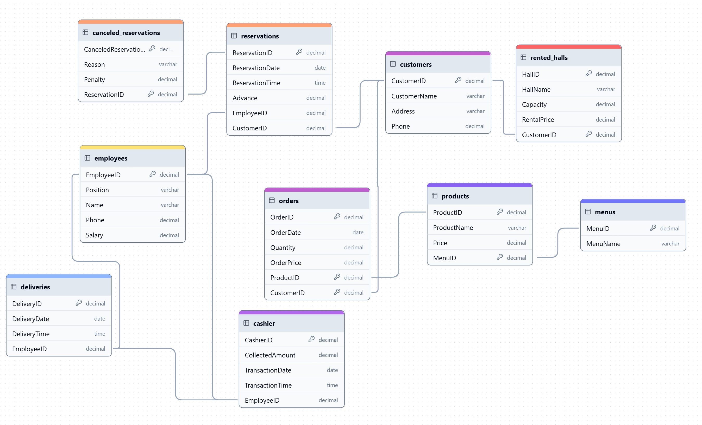

<h1 align="center">
    🍜 MySQL_Restaurant_Database
     
    

    Restaurant Reservations, Deliveries, and Orders Database
</h1>
<h3>Specifications for the Fictional Company:</h3>
<ol>
    <li>
        <h4>General Overview:</h4>
        
The company manages information about customer reservations, orders, deliveries, products, and employee transactions in a restaurant, aiming to enhance the service experience and track business operations efficiently.

    </li>
    <li>
        <h4>☎️ Reservations:</h4>
        <ul>
            <li><b>Table Reservation (table_reservation):</b> Each reservation is identified by a unique ID (reservationID), which stores the details of the date, time, and customer information.</li>
            <li><b>Attributes:</b>
                <ul>
                    <li>Reservation ID (reservationID): Unique identifier for each reservation.</li>
                    <li>Date and time of the reservation (date, time).</li>
                    <li>Employee handling the reservation (employeeID).</li>
                    <li>Customer ID (customerID): Refers to the customer who made the reservation.</li>
                </ul>
            </li>
            <li><b>Venue:</b> Each room is rented to one customer at a time, with details like capacity and rental price.</li>
        </ul>
    </li>
    <li>
        <h4>❌ Canceled Reservations:</h4>
        <ul>
            <li><b>Cancel Reservation (canceled_reservation):</b> Tracks reservations that were canceled and stores the reason for cancellation along with a reference to the original reservation.</li>
            <li><b>Attributes:</b>
                <ul>
                    <li>Cancel ID (cancelID): Unique identifier for the canceled reservation.</li>
                    <li>Reason for cancellation (reason): Can include reasons such as "No-show", "Changed plans", etc.</li>
                    <li>Reservation ID (reservationID): The ID of the reservation that was canceled.</li>
                </ul>
            </li>
        </ul>
    </li>
    <li>
        <h4>👦 Clients:</h4>
        <ul>
            <li><b>Customer (customer):</b> Each customer has a unique customer ID and is associated with personal details.</li>
            <li><b>Attributes:</b>
                <ul>
                    <li>Customer ID (customerID): Unique identifier for each customer.</li>
                    <li>Name (name): Full name of the customer.</li>
                    <li>Address (address): The residential address of the customer.</li>
                    <li>Phone number (phone): Contact number for the customer.</li>
                </ul>
            </li>
            <li>A customer can place multiple orders and make multiple reservations.</li>
        </ul>
    </li>
    <li>
        <h4>📦 Orders:</h4>
        <ul>
            <li><b>Order (orders):</b> Each order is tracked with a unique order ID and includes information about the ordered products and customer details.</li>
            <li><b>Attributes:</b>
                <ul>
                    <li>Order ID (orderID): Unique identifier for each order.</li>
                    <li>Date of the order (date): When the order was placed.</li>
                    <li>Quantity (quantity): The number of products ordered.</li>
                    <li>Product ID (productID): The ID of the product(s) being ordered.</li>
                    <li>Customer ID (customerID): The customer who placed the order.</li>
                    <li>Employee ID (employeeID): The employee who processed the order.</li>
                </ul>
            </li>
        </ul>
    </li>
    <li>
        <h4>🍅 Products:</h4>
        <ul>
            <li><b>Product (product):</b> Each product available in the restaurant is uniquely identified and includes details such as price and description.</li>
            <li><b>Attributes:</b>
                <ul>
                    <li>Product ID (productID): Unique identifier for each product.</li>
                    <li>Name (name): The name of the product.</li>
                    <li>Description (description): A brief description of the product.</li>
                    <li>Price (price): The price of the product.</li>
                </ul>
            </li>
        </ul>
    </li>
    <li>
        <h4>💵 Cashier Transactions:</h4>
        <ul>
            <li><b>Cashier Transaction (cashier):</b> Tracks transactions made by customers, including the payment method and the employee handling the transaction.</li>
            <li><b>Attributes:</b>
                <ul>
                    <li>Cashier ID (cashierID): Unique identifier for each transaction.</li>
                    <li>Method of payment (method): Specifies how the payment was made (e.g., cash, credit card).</li>
                    <li>Employee ID (employeeID): The employee responsible for processing the transaction.</li>
                </ul>
            </li>
        </ul>
    </li>
    <li>
        <h4>🔔 Deliveries:</h4>
        <ul>
            <li><b>Delivery (delivery):</b> Each delivery is associated with an order and tracks delivery details like the employee and time of delivery.</li>
            <li><b>Attributes:</b>
                <ul>
                    <li>Delivery ID (deliveryID): Unique identifier for each delivery.</li>
                    <li>Time of delivery (time): The time at which the delivery took place.</li>
                    <li>Employee ID (employeeID): The employee responsible for the delivery.</li>
                </ul>
            </li>
        </ul>
    </li>
    <li>
        <h4>👨‍💼 Employees:</h4>
        <ul>
            <li><b>Employee (employee):</b> Each employee is uniquely identified and holds a position within the company (e.g., waiter, cook, cashier, driver).</li>
            <li><b>Attributes:</b>
                <ul>
                    <li>Employee ID (employeeID): Unique identifier for each employee.</li>
                    <li>Name (name): Full name of the employee.</li>
                    <li>Position (position): The job role of the employee.</li>
                    <li>Salary (salary): The salary of the employee.</li>
                </ul>
            </li>
        </ul>
    </li>
    <li>
        <h4>📝 Feedback:</h4>
        <ul>
            <li><b>Feedback (feedback):</b> Customers can provide feedback on their orders, including a rating and any comments about the service.</li>
            <li><b>Attributes:</b>
                <ul>
                    <li>Feedback ID (feedbackID): Unique identifier for each feedback entry.</li>
                    <li>Rating (rating): Numeric rating (usually 1 to 5 stars).</li>
                    <li>Date (date): The date the feedback was given.</li>
                    <li>Customer ID (customerID): The customer who provided the feedback.</li>
                </ul>
            </li>
        </ul>
    </li>
</ol>
    <h3>Entity Relationship Diagram</h3>
    
