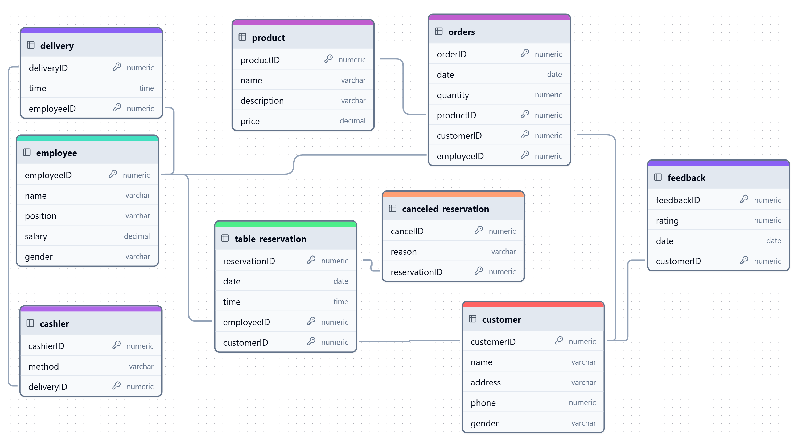

<h1 align="center">
    🍜 Restaurant Database
     
    

    Restaurant Reservations, Deliveries, and Orders Database
</h1>
<h3>Case Study</h3>
    <h4>Objective</h4>
    
This study explores key insights from a restaurant's operations database to analyze customer behavior, employee performance, product sales, and financial trends. The queries focus on reservations, orders, feedback, and employee activity.

<h3>Specifications for the Fictional Company:</h3>
<ol>
    <li>
        <h4>General Overview:</h4>
        
The company manages information about customer reservations, orders, deliveries, products, and employee transactions in a restaurant, aiming to enhance the service experience and track business operations efficiently.

    </li>
    <li>
        <h4>☎️ Reservations:</h4>
        <ul>
            <li><b>Table Reservation (table_reservation):</b> Each reservation is identified by a unique ID (reservationID), which stores the details of the date, time, and customer information.</li>
            <li><b>Attributes:</b>
                <ul>
                    <li>Reservation ID (reservationID): Unique identifier for each reservation.</li>
                    <li>Date and time of the reservation (date, time).</li>
                    <li>Employee handling the reservation (employeeID).</li>
                    <li>Customer ID (customerID): Refers to the customer who made the reservation.</li>
                </ul>
            </li>
        </ul>
    </li>
    <li>
        <h4>❌ Canceled Reservations:</h4>
        <ul>
            <li><b>Cancel Reservation (canceled_reservation):</b> Tracks reservations that were canceled and stores the reason for cancellation along with a reference to the original reservation.</li>
            <li><b>Attributes:</b>
                <ul>
                    <li>Cancel ID (cancelID): Unique identifier for the canceled reservation.</li>
                    <li>Reason for cancellation (reason): Can include reasons such as "No-show", "Changed plans", etc.</li>
                    <li>Reservation ID (reservationID): The ID of the reservation that was canceled.</li>
                </ul>
            </li>
        </ul>
    </li>
    <li>
        <h4>👦 Clients:</h4>
        <ul>
            <li><b>Customer (customer):</b> Each customer has a unique customer ID and is associated with personal details.</li>
            <li><b>Attributes:</b>
                <ul>
                    <li>Customer ID (customerID): Unique identifier for each customer.</li>
                    <li>Name (name): Full name of the customer.</li>
                    <li>Address (address): The residential address of the customer.</li>
                    <li>Phone number (phone): Contact number for the customer.</li>
                    <li>Gender (gender).</li>
                </ul>
            </li>
            <li>A customer can place multiple orders and make multiple reservations.</li>
        </ul>
    </li>
    <li>
        <h4>📦 Orders:</h4>
        <ul>
            <li><b>Order (orders):</b> Each order is tracked with a unique order ID and includes information about the ordered products and customer details.</li>
            <li><b>Attributes:</b>
                <ul>
                    <li>Order ID (orderID): Unique identifier for each order.</li>
                    <li>Date of the order (date): When the order was placed.</li>
                    <li>Quantity (quantity): The number of products ordered.</li>
                    <li>Product ID (productID): The ID of the product(s) being ordered.</li>
                    <li>Customer ID (customerID): The customer who placed the order.</li>
                    <li>Employee ID (employeeID): The employee who processed the order.</li>
                </ul>
            </li>
        </ul>
    </li>
    <li>
        <h4>🍅 Products:</h4>
        <ul>
            <li><b>Product (product):</b> Each product available in the restaurant is uniquely identified and includes details such as price and description.</li>
            <li><b>Attributes:</b>
                <ul>
                    <li>Product ID (productID): Unique identifier for each product.</li>
                    <li>Name (name): The name of the product.</li>
                    <li>Description (description): A brief description of the product.</li>
                    <li>Price (price): The price of the product.</li>
                </ul>
            </li>
        </ul>
    </li>
    <li>
        <h4>💵 Cashier Transactions:</h4>
        <ul>
            <li><b>Cashier Transaction (cashier):</b> Tracks transactions made by customers, including the payment method and the employee handling the transaction.</li>
            <li><b>Attributes:</b>
                <ul>
                    <li>Cashier ID (cashierID): Unique identifier for each transaction.</li>
                    <li>Method of payment (method): Specifies how the payment was made (e.g., cash, credit card).</li>
                    <li>Employee ID (employeeID): The employee responsible for processing the transaction.</li>
                </ul>
            </li>
        </ul>
    </li>
    <li>
        <h4>🔔 Deliveries:</h4>
        <ul>
            <li><b>Delivery (delivery):</b> Each delivery is associated with an order and tracks delivery details like the employee and time of delivery.</li>
            <li><b>Attributes:</b>
                <ul>
                    <li>Delivery ID (deliveryID): Unique identifier for each delivery.</li>
                    <li>Time of delivery (time): The time at which the delivery took place.</li>
                    <li>Employee ID (employeeID): The employee responsible for the delivery.</li>
                </ul>
            </li>
        </ul>
    </li>
    <li>
        <h4>👨‍💼 Employees:</h4>
        <ul>
            <li><b>Employee (employee):</b> Each employee is uniquely identified and holds a position within the company (e.g., waiter, cook, cashier, driver).</li>
            <li><b>Attributes:</b>
                <ul>
                    <li>Employee ID (employeeID): Unique identifier for each employee.</li>
                    <li>Name (name): Full name of the employee.</li>
                    <li>Position (position): The job role of the employee.</li>
                    <li>Salary (salary): The salary of the employee.</li>
                    <li>Gender (gender).</li>
                </ul>
            </li>
        </ul>
    </li>
    <li>
        <h4>📝 Feedback:</h4>
        <ul>
            <li><b>Feedback (feedback):</b> Customers can provide feedback on their orders, including a rating and any comments about the service.</li>
            <li><b>Attributes:</b>
                <ul>
                    <li>Feedback ID (feedbackID): Unique identifier for each feedback entry.</li>
                    <li>Rating (rating): Numeric rating (usually 1 to 5 stars).</li>
                    <li>Date (date): The date the feedback was given.</li>
                    <li>Customer ID (customerID): The customer who provided the feedback.</li>
                </ul>
            </li>
        </ul>
    </li>
</ol>
    <h3>Entity Relationship Diagram</h3>
    
    <h3>Case Study Queries and Outputs</h3>
    <ol>
        <h4><li>Customer Analysis</li></h4>
      <ol>
        <li>Which customers had reservations on 2023-12-18?</li>
          
          
Boicu Daniela demonstrates engagement on a specific date. She could be a candidate for further follow-up or retention strategies.

        <li>Who is the customer with the most reservations in the restaurant?</li>
          
          
Georgescu Angelica’s frequent reservations highlight her as a highly loyal customer. She is an excellent candidate for a VIP or reward program.

        <li>Which customers have more reservations than Martinas Ramona?</li>
          
          
Georgescu Angelica’s reservation count surpasses Martinas Ramona, reaffirming her as the most engaged customer in this category.

        <li>Who is the customer who made the most expensive order?</li>
          
          
Pal Andreea’s high-value order represents significant spending behavior. Targeting similar customers with premium offerings could enhance revenue.

        <li>Which customers placed more than one order?</li>
          
          
The presence of multiple frequent buyers indicates a healthy, loyal customer base. They are prime candidates for loyalty programs or promotional campaigns.

      </ol>
          <h4><li>Order Analysis</li></h4>
      <ol>
        <li>How many orders took place on 2023-12-09, and who honored them?</li>
          
          
Victor Tudor’s involvement on this day reflects active participation. The result helps assess workload and efficiency.

        <li>What is the average price of orders made in the first half of December?</li>
          
          
This high average indicates a solid spending capacity among customers during the period, suggesting effective pricing strategies.

      </ol>
            <h4><li>Payment Analysis</li></h4>
      <ol>
        <li> What is the most common payment method used for deliveries made after 1 PM?</li>
          
          
Cash being the preferred method highlights customer comfort with traditional payment methods in this timeframe. Additional support for mobile payments could encourage diversification.

        <li>What percentage does each type of payment have?</li>
          
          
While card payments dominate slightly, cash still accounts for a significant share. Mobile payments lag, suggesting an opportunity to promote digital payment methods.

      </ol>
            <h4><li>Product Analysis</li></h4>
      <ol>
        <li>Extract the top 4 products with the most orders.</li>
          
          
These popular items should be prioritized in inventory and marketing, especially during promotions or events.

        <li>What products were most frequently sold on weekends?</li>
          
          
These items’ weekend popularity suggests they could be leveraged for targeted weekend promotions or special deals.

      </ol>
            <h4><li>Employee Analysis</li></h4>
      <ol>
        <li>Which employees handle each order placed by customers?</li>
          
          
The data provides accountability and insights into employee workload distribution, aiding in workforce optimization.

        <li>Which employees have salaries above or below 2500 RON?</li>
          
          
Elena Stanciu earning less than 2500 RON and Paul Enea earning more than 2500 RON exemplify salary disparity. Insights can guide fair compensation policies.

        <li>Which employees processed payments by Cash or Credit Card?</li>
          
          
Cristina Matei (Card) and Ioan Toma (Cash) showcase different transactional expertise. This distinction could inform role assignments or training needs.

        <li>Which employees made the highest number of deliveries?</li>
          
          
Identifying top-performing delivery personnel supports rewarding high productivity and setting benchmarks for others.

        <li> What is the average salary by gender, including minimum and maximum values?</li>
          
          
The average salaries show gender equity, but some discrepancies in the minimum salaries (Male: 2200 RON; Female: 2000 RON) highlight potential areas for review.

        <li>Which employee did not make any reservation or deliveries?</li>
          
          
Claudia Iordache, Bogdan Gheorghe, Florina Costache and Mario Dumitru underutilizations calls for a reassessment of their roles or assignments.

      </ol>
            <h4><li>Reservation Analysis</li></h4>
      <ol>
        <li>Which reservations were canceled on the same day as made on 2023-12-10?</li>
          
          
Same-day cancellations could indicate customer indecision or operational issues that need addressing.

        <li>Display the customer with the most reservations.</li>
          
          
Georgescu Angelica’s frequent bookings highlight her as a top loyalist, suitable for personalized rewards.

        <li>Were most reservations canceled during the week or weekend?</li>
          
          
Equal cancellations on weekends and weekdays suggest consistent operational or customer challenges across both timeframes.

        <li>What is the most common reason for canceling a reservation?</li>
          
          
This indicates that better reservation management tools or flexible scheduling options could reduce cancellations.

      </ol>
            <h4><li>Feedback Analysis</li></h4>
      <ol>
        <li>What feedback from customers predominates the most?</li>
          
          
Customer satisfaction is overwhelmingly positive, signaling strong service quality and customer experience.

      </ol>
    </ol>
    <h3>Conclusion</h3>
    
The analysis reveals key insights:

    <ul>
      <li><b>Customer Behavior: </b>Georgescu Angelica and other top customers should be prioritized for personalized offers.</li>
      <li><b>Product Trends: </b>Focusing on top products and weekend specials will enhance revenue and customer satisfaction.</li>
      <li><b>Employee Efficiency: </b>Rewarding high-performing employees and addressing salary disparities could improve overall morale.</li>
      <li><b>Operational Improvements: </b>Addressing reasons for cancellations and promoting mobile payment methods are actionable goals.</li>
      <li><b>Payment Trends: </b>Cash and Card payment methods streamlines transactions and enhances customer convenience.</li>
      <li><b>Customer Satisfaction: </b>Positive feedback reflects strong service, though maintaining and improving it remains critical.</li>
    </ul>
    
These findings support strategic decisions for customer engagement, operational efficiency, and sustained business growth.

    
